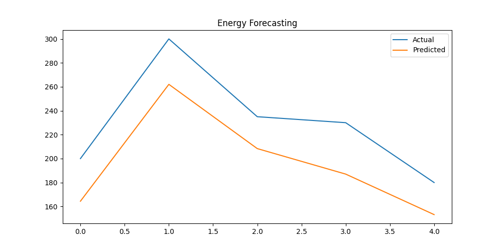

# AI-Powered Energy Consumption Forecasting System

Overview

An end-to-end Machine Learning project that forecasts future energy consumption using historical data and provides analytical insights for efficient energy management.

Problem Statement

Unpredictable energy consumption leads to:

• Power outages (blackouts)  
• Energy wastage  
• High electricity costs  
• Inefficient demand-supply planning  

This project addresses these challenges using predictive analytics.

Solution

This system uses historical energy consumption data such as:

• Time-based patterns (hour, day)  
• Energy usage values  

A Machine Learning model (MLP Regressor) is trained to predict:

• Future energy consumption  

Key Features

• End-to-end ML pipeline (Data → Training → Prediction)  
• Time-series forecasting using Machine Learning  
• Feature engineering using time-based patterns  
• Data visualization (Actual vs Predicted)  
• Model saving using Joblib  
• Modular and scalable project structure  

Output Preview

Sample Output

• Input: Hour=14, Day=2  
• Output: Predicted Energy Consumption = 120.5 units  

Tech Stack

• Python  
• Pandas, NumPy  
• Scikit-learn  
• Matplotlib  
• Joblib  

Project Structure

AI-Energy-Forecasting/
│
├── data/
├── models/
├── outputs/
├── images/
├── src/
│
├── preprocessing.py
├── model.py
├── predict.py
├── visualize.py
│
├── main.py
│
├── requirements.txt
└── README.md

How It Works

1. Data is loaded and cleaned  
2. Time-based features are extracted  
3. Model is trained using historical data  
4. Model is saved using Joblib  
5. Predictions are generated  
6. Results are visualized  

How to Run

1. Clone Repository

git clone https://github.com/Nikhatjahan85/AI-Energy-Forecasting.git  
cd AI-Energy-Forecasting  

2. Install Dependencies

pip install -r requirements.txt  

3. Run Project

python main.py  

Future Improvements

• Integration with real-time energy data  
• Implementation of deep learning models (LSTM)  
• Dashboard using Streamlit  
• Cloud deployment (AWS / Azure)  

Author

Nikhat Jahan  
GitHub: https://github.com/Nikhatjahan85  

